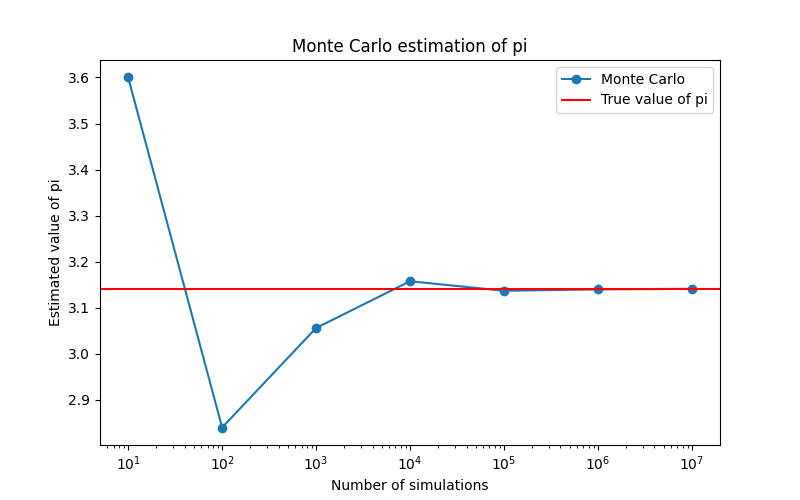
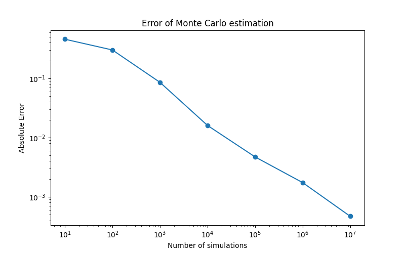

# Monte Carlo Estimation of Pi

## Project Overview

This project estimates the value of π using a Monte Carlo simulation.

Random points are generated uniformly inside the square [-1,1] × [-1,1]. The proportion of points falling inside the unit disk is then used to estimate π.

The project illustrates the Law of Large Numbers and introduces Monte Carlo methods, which are widely used in quantitative finance, actuarial science and scientific computing.

## Mathematical Background

The area of the square [-1,1] × [-1,1] is:

Area(square) = 4

The area of the unit disk is:

Area(disk) = π

Therefore,

P((X,Y) belongs to the disk) = π / 4

which implies

π = 4 × P((X,Y) belongs to the disk)

The probability is estimated by simulation.

## Technologies

* Python
* NumPy
* Matplotlib

## Results

The simulation shows that:

* the estimation converges toward π as the number of simulations increases;
* the estimation error decreases when more points are generated.

## Visualizations

### Convergence of the estimator

### Estimation error

## Key Concepts

* Monte Carlo Methods
* Probability Theory
* Law of Large Numbers
* Statistical Simulation
* Numerical Approximation

## Author

Mame Thierno Thiam

Future M1 Financial Engineering Student at CY Paris Université.

